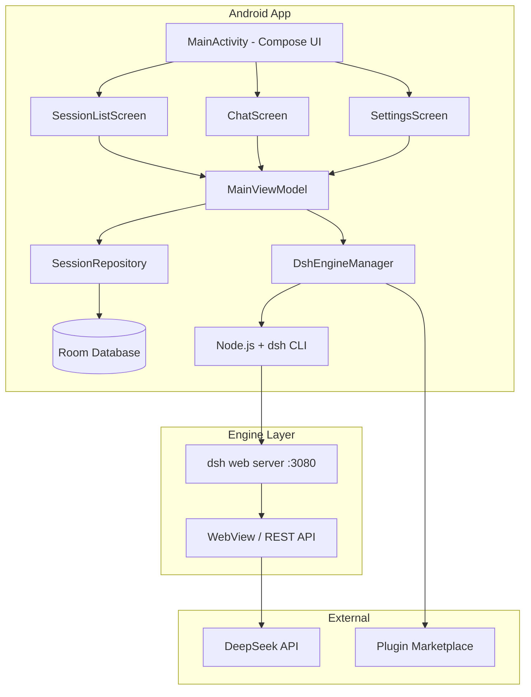

# DeepSeek Harness Mobile

**DeepSeek Harness Android 应用** — 原生 Kotlin Android 应用，零依赖运行 DeepSeek Harness 引擎，覆盖网页端全部功能。

[](./LICENSE)
[](https://www.android.com/)
[](https://developer.android.com/about/versions/android-8.0)

---

## 项目简介

DeepSeek Harness (dsh) 是 DeepSeek AI 开源的 Agent 框架，原仅支持 PC 浏览器访问。本项目将其完整迁移至 Android 平台，实现：

- **零依赖安装**：内置 Node.js + dsh CLI，下载即用，无需 Root/Termux/额外下载
- **全功能覆盖**：完美复刻 Web 端对话、插件市场、会话管理、设置等核心功能
- **竖屏优化**：专为手机屏幕设计的竖版 UI，流畅触控交互
- **本地优先**：支持本地模式（Android）和云端模式（跨平台）双架构

---

## 解决了什么问题？

| 痛点 | 解决方案 |
|------|----------|
| dsh 仅支持 PC 浏览器，无法在手机上使用 | 原生 Android 应用，随时随地使用 |
| 需要 Node.js 环境和命令行操作 | 内置运行时，开箱即用 |
| 移动端体验不佳，Web UI 在手机上难以操作 | 原生竖屏 UI，适配触控交互 |
| 移动网络不稳定导致连接中断 | 本地引擎保活机制 + 自动重连 |
| 多设备数据同步需求 | SQLite 本地存储 + 云端同步可选 |

---

## 快速上手

### 前置条件

- Android Studio Ladybug 或更新版本
- JDK 17+
- Android SDK API 34
- Gradle 8.5+

### 构建步骤

```bash
# 1. 克隆项目
git clone https://github.com/<your-org>/dsh-mobile.git
cd dsh-mobile

# 2. 准备引擎资源（需从 deepseek-harness 编译）
# 将编译好的 node 和 dsh 二进制放入 app/src/main/assets/engine/
# 或使用预构建版本

# 3. 构建 Debug APK
./gradlew assembleDebug

# 4. 构建 Release APK（需签名配置）
./gradlew assembleRelease
```

### 安装到设备

```bash
# 通过 ADB 安装
adb install app/build/outputs/apk/debug/dsh-mobile-debug.apk

# 或直接发送文件到手机安装
```

---

## 功能特性

### 核心功能

- **对话界面**：气泡消息、代码高亮、流式响应
- **会话管理**：创建/切换/搜索/删除会话
- **插件市场**：浏览和安装 DSH 插件
- **模型设置**：切换默认模型、配置 API Key
- **后台保活**：Foreground Service 确保引擎持续运行

### 技术亮点

| 特性 | 实现方式 |
|------|----------|
| 本地引擎运行 | 内置 Node.js ARM64 二进制 + dsh CLI |
| WebView 适配 | 响应式布局 + JavaScript 桥接 |
| 数据持久化 | Room Database + DataStore |
| 网络通信 | OkHttp + WebSocket |
| 状态管理 | Jetpack Compose + ViewModel + StateFlow |
| 依赖注入 | Dagger Hilt |

---

## 项目结构

```
dsh-mobile/
├── app/src/main/
│   ├── java/com/deepseek/dshmobile/
│   │   ├── DSHApplication.kt      # 应用入口 + Hilt 初始化
│   │   ├── di/                    # Dagger Hilt 组件
│   │   ├── service/               # 引擎管理服务
│   │   │   ├── DshEngineService.kt  # Foreground Service
│   │   │   └── DshEngineManager.kt  # 引擎生命周期管理
│   │   ├── database/              # Room 数据库
│   │   ├── repository/            # 数据仓库
│   │   ├── ui/
│   │   │   ├── MainActivity.kt    # Compose 主界面
│   │   │   ├── theme/             # Material 3 主题
│   │   │   ├── components/        # 自定义组件
│   │   │   ├── screens/           # 页面 Screen
│   │   │   ├── nav/               # 导航
│   │   │   └── viewmodel/         # ViewModel
│   │   └── receiver/              # 系统广播接收器
│   ├── res/                       # 资源文件
│   └── assets/engine/             # 引擎二进制（需自行准备）
├── gradle/
│   └── libs.versions.toml         # 版本目录
├── build.gradle.kts               # 根构建配置
└── settings.gradle.kts            # 项目设置
```

---

## 架构设计



---

## GitHub 仓库配置

发布到 GitHub 时，建议使用以下 `.gitignore` 模板：

```gitignore
# 构建输出
*.apk
*.aab
/build/
.gradle/

# 本地配置
local.properties
*.log

# Android Studio
.idea/
*.iml
.cxx/

# 密钥文件（不要提交）
*.jks
*.keystore

# 生成的文件
app/build/
app/generated/

# DSH 引擎资产（二进制文件）
app/src/main/assets/engine/
```

**推荐选择**：在 GitHub 创建仓库时选择 **"Android"** 模板，然后添加上述自定义规则。

---

## 贡献指南

欢迎提交 Issue 和 Pull Request！

### 开发流程
```bash
# 1. Fork 本仓库
# 2. 创建特性分支
git checkout -b feature/amazing-feature

# 3. 提交更改
git commit -m 'feat: add amazing feature'

# 4. 推送到分支
git push origin feature/amazing-feature

# 5. 创建 Pull Request
```

### 构建验证

```bash
# 运行所有测试
./gradlew test

# 检查代码质量
./gradlew lintDebug

# 构建 Debug APK
./gradlew assembleDebug
```

---

## 协议

本项目采用 [MIT License](./LICENSE)。

---

## 致谢

- [DeepSeek Harness](https://github.com/deepseek-ai/deepseek-harness) - 核心框架
- [Jetpack Compose](https://developer.android.com/jetpack/compose) - 现代 UI 框架
- [Dagger Hilt](https://dagger.dev/hilt/) - 依赖注入框架
- [Room](https://developer.android.com/training-data-storage/room) - 本地数据库
